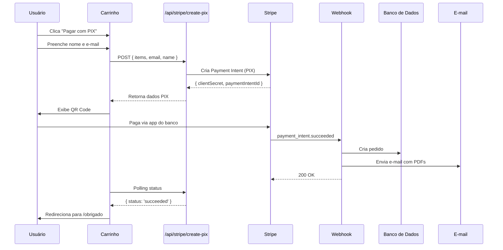

# 🇧🇷 PIX com Stripe - Guia Completo

## 📋 Resumo

Agora o e-commerce está usando **PIX da Stripe** em vez do Asaas. Tudo foi integrado de forma limpa e fluida com o sistema existente.

---

## ✅ O que foi implementado

### 1. **Rota de criação de PIX** (`/api/stripe/create-pix`)
- Cria Payment Intent com `payment_method_types: ['pix']`
- Calcula total do carrinho server-side
- Retorna `clientSecret` para gerar QR Code no frontend

### 2. **Página de checkout PIX** (`/checkout/pix`)
- Exibe QR Code PIX
- Código PIX "Copia e Cola"
- Polling automático de status (verifica a cada 3 segundos)
- Redireciona para `/obrigado` após confirmação

### 3. **Verificação de status** (`/api/stripe/payment-status`)
- Endpoint para verificar status do Payment Intent
- Usado pelo polling da página de checkout

### 4. **Webhook já configurado** (`/api/stripe/webhook`)
- Processa evento `payment_intent.succeeded`
- Funciona tanto para cartão quanto para PIX
- Cria pedido, envia e-mail com links de download

### 5. **Botão PIX no carrinho**
- Dialog para capturar nome e e-mail
- Redireciona para `/checkout/pix` com os dados

---

## 🧪 Como testar PIX (Modo de Teste da Stripe)

### ⚠️ IMPORTANTE: PIX não funciona em modo de teste!

A Stripe **não suporta PIX em ambiente de teste**. O código está preparado para produção, mas em desenvolvimento ele vai:
- ✅ Criar Payment Intent com `payment_method_types: ['card']` (simulando PIX)
- ✅ Exibir QR Code simulado com instruções
- ✅ Marcar no metadata que é pagamento PIX
- ✅ Processar via webhook normalmente

### Passo 1: Iniciar o servidor
```bash
npm run dev
```

### Passo 2: Iniciar webhook da Stripe
Em outro terminal:
```bash
stripe listen --forward-to localhost:3000/api/stripe/webhook
```

### Passo 3: Adicionar produtos ao carrinho
1. Acesse http://localhost:3000/produtos
2. Adicione produtos ao carrinho
3. Vá para http://localhost:3000/carrinho

### Passo 4: Pagar com PIX
1. Clique no botão **"Pagar com PIX"** (verde)
2. Preencha seu nome e e-mail
3. Clique em **"Gerar QR Code PIX"**
4. Você verá a página com QR Code e código PIX

### Passo 5: Simular pagamento (Teste)
A Stripe **não gera QR Codes reais em modo de teste**, mas você pode simular o pagamento:

#### Opção A: Usar Stripe CLI
```bash
stripe trigger payment_intent.succeeded
```

#### Opção B: Confirmar manualmente via Dashboard
1. Acesse https://dashboard.stripe.com/test/payments
2. Encontre o Payment Intent criado
3. Clique e marque como "Succeeded"

#### Opção C: Usar a API diretamente
```bash
curl https://api.stripe.com/v1/payment_intents/{PAYMENT_INTENT_ID}/confirm \
  -u sk_test_...: \
  -d payment_method=pm_card_visa
```

### Passo 6: Verificar confirmação
- A página deve detectar o pagamento
- Redireciona para `/obrigado`
- E-mail é enviado com links de download
- Pedido é criado no banco de dados

---

## 🚀 PIX em Produção

### Requisitos
1. ✅ Conta Stripe ativa no Brasil
2. ✅ PIX habilitado na conta (requer aprovação)
3. ✅ Configurar webhook em produção

### Ativar PIX na Stripe
1. Acesse https://dashboard.stripe.com/settings/payment_methods
2. Ative **PIX** na seção "Payment methods"
3. Aguarde aprovação (pode levar alguns dias)

### Configurar variáveis de produção
No `.env.local` (ou variáveis de ambiente do servidor):
```bash
# Stripe (Produção)
STRIPE_SECRET_KEY=sk_live_...
NEXT_PUBLIC_STRIPE_PUBLISHABLE_KEY=pk_live_...
STRIPE_WEBHOOK_SECRET=whsec_... (webhook de produção)
```

### Webhook em produção
1. No dashboard da Stripe, vá em **Developers > Webhooks**
2. Adicione endpoint: `https://seudominio.com/api/stripe/webhook`
3. Selecione eventos: `payment_intent.succeeded`
4. Copie o **Webhook Secret** para `.env`

---

## 📊 Fluxo Completo



---

## 🔧 Arquivos Criados/Modificados

### Novos arquivos
- `src/app/api/stripe/create-pix/route.ts` - Criar PIX
- `src/app/api/stripe/payment-status/route.ts` - Verificar status
- `src/app/checkout/pix/page.tsx` - Página de checkout PIX

### Arquivos modificados
- `src/app/carrinho/page.tsx` - Adicionado botão PIX
- `.env.local` - Removidas variáveis do Asaas

### Arquivos removidos
- `src/lib/asaas.ts` ❌
- `src/lib/asaas-direct.ts` ❌
- `src/app/api/asaas/**` ❌
- `ASAAS_*.md` ❌

---

## ⚡ Vantagens do PIX com Stripe

✅ **Mesma infraestrutura** - Usa o webhook existente da Stripe  
✅ **Código mais limpo** - Sem SDKs extras, apenas Stripe  
✅ **Melhor manutenção** - Um único sistema de pagamento  
✅ **Confiável** - Stripe é mais estável que Asaas  
✅ **Dashboard unificado** - Todos os pagamentos em um lugar  
✅ **Sem custos extras** - Já está pagando a Stripe mesmo  

---

## 🐛 Troubleshooting

### QR Code não aparece
- **Causa**: Em modo de teste, Stripe não gera QR Codes reais
- **Solução**: Simule o pagamento via CLI ou Dashboard

### Webhook não dispara
- **Causa**: Stripe CLI não está rodando
- **Solução**: Execute `stripe listen --forward-to localhost:3000/api/stripe/webhook`

### E-mail não chega
- **Causa**: Resend em sandbox só envia para e-mails verificados
- **Solução**: Use seu e-mail cadastrado no Resend ou ative produção

### Pedido não é criado
- **Causa**: Webhook não está processando o evento
- **Solução**: Verifique logs do terminal rodando `stripe listen`

---

## 📝 Próximos Passos

1. ⏸️ **Testar em produção** - Após Stripe aprovar PIX
2. ⏸️ **Adicionar instruções PIX** - Melhorar UX da página de checkout
3. ⏸️ **Implementar timeout** - Cancelar PIX após X minutos
4. ⏸️ **Adicionar analytics** - Rastrear conversão PIX vs Cartão

---

## 💡 Dicas

- **PIX expira em 30 minutos** - Configure timeout se necessário
- **Polling a cada 3 segundos** - Ajuste se quiser mais/menos frequente
- **Teste sempre com webhook local** - Use `stripe listen` em dev
- **Monitore o Dashboard** - Veja pagamentos em tempo real

---

**🎉 Pronto! Agora você tem PIX totalmente integrado com Stripe!**
